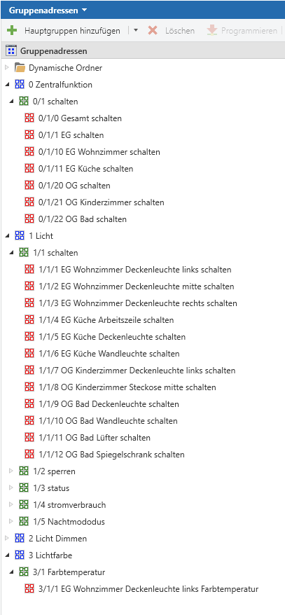

# KNX Gruppenadressen Generator 

Mit diesem kleinen Tool können KNX Gruppenadressen generiert werden. Das Tool ist ein Kommandozeilenprogramm und erwartet die Definition der Gruppenadressen im yaml Format. Es gibt keine grafische Oberfläche. Gruppenadressen können sehr unterschiedlich aufgebaut sein. Dieses Tool verfolgt den Ansatz von https://smarthomebau.de/knx-ets-gruppenadressen-die-geordnete-struktur-im-einfamilienhaus/ 

## TL;DR
```bash
1. Erzeuge eine Beispieldatei
knx-ga-generator-macos createExample -o example.yaml

2. Erzeuge aus dem Beispiel Gruppenadressen
knx-ga-generator-<macos|linux|win> generate -s example.yaml -o gruppenadressen.csv
```

## Einfaches Beispiel
Zunächst wird definiert, welche Funktionen es im Gebäude gibt. In dem kleinen Beispiel kümmern wir uns um das Licht. Bei KNX kann ein Licht typischerweise geschaltet, der Lichtkanal kann gesperrt und der aktuelle Status (ein/aus) abgefragt werden.
```yaml
actionGroupConfig:
  - name: "Licht"
    main: 1 # eine spätere Hauptgruppe
    usedForFeatures: [ "schalten" ] # Alle 'things' eines Gebäude, die das Feature "schalten" haben, werden nachfolgende Aktionen zugewiesen. 
    actions: [
      { name: "schalten", middle: 1 },
      { name: "sperren", middle: 2 },
      { name: "status", middle: 3 },
    ]
```
Anschließend definieren wir das Gebäude:
```yaml
building:
  name: "Mein Haus"  
  floors:
    - floor: "EG"      
      rooms:
        - room: "Wohnzimmer"          
          things: [
            { feature: "schalten", description: "Deckenleuchte links", sub: 1 },
            { feature: "schalten", description: "Deckenleuchte mitte", sub: 2 },
            { feature: "schalten", description: "Deckenleuchte rechts", sub: 3 },
          ]
        - room: "Küche"
          things: [
            { feature: "schalten", description: "Arbeitszeile", sub: 4 },
            { feature: "schalten", description: "Deckenleuchte", sub: 5 },
            { feature: "schalten", description: "Wandleuchte", sub: 6 },
          ]

```

Diese [Datei](./assets/simple-example.yaml) wird in dem Beispiel unter `c:\example\simple-example.yaml` gespeichert.

Dem Tool übergebe ich folgende Parameter
```bash
knx-ga-generator-win.exe generate -s simple-example.yaml -o simple-example.csv
```
Die generierte CSV Datei [simple-example.csv](/doc/simple-example.csv) wird anschließend in die ETS importiert:

## Umfangreicheres Beispiel
Ein etwas umfangereicheres Beispiel findet sich in der Definition [complex-example.yaml](./assets/complex-example.yaml) aus der schließlich die Datei [complex-example.csv](./doc/complex-example.csv) für den Import in die ETS generiert wird. Neben weiteren Etagen sind hier Zentralfunktionen definiert. Zentralfunktionen sind Aktionen, die für jeden Raum und jede Etage definiert werden. Sie unterscheiden sich in der Definition nicht von normalen Funktionen:
```yaml
actionGroupConfig:
  - name: "Zentralfunktion"
    main: 0 #eine spätere Hauptgruppe
    usedForFeatures: [ "zentral" ] #Alle 'things' eines Gebäude, die das Feature "schalten" haben, werden nachfolgende Aktionen zugewiesen.
    actions: [
      { name: "schalten", middle: 1 },
    ]
 ```
Zentralfunktion für das Gebäude werden mittels `centralFeatures:` aktiviert. Über das Element `centralSub:` kann ein Gebäudeteil (Gebäude, Flur, Raum) für die Zentralfunktion aktiviert werden.
In dem Beispiel wird das oben definierte Feature `Zentralfunkiont` als Zentralfunkion aktiviert, weil `usedForFeatures` und `centralFeatures` den gleichen Wert `"zentral"` haben. 
Es werden für
* das gesamte Gebäude, 
* den Flur 
* und das Wohnzimmer

Zentralfunktionen generiert.
```yaml
building:
  name: "Mein Haus"
  centralFeatures: [ "zentral" ]
  centralSub: 0
  floors:
    - floor: "EG"
      centralSub: 1
      rooms:
        - room: "Wohnzimmer"
          centralSub: 10
...

```
Nach dem Import der Datei in die ETS sieht das zweite Beispiel so aus:

